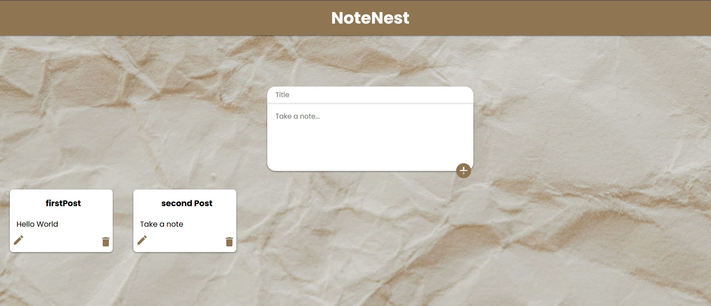
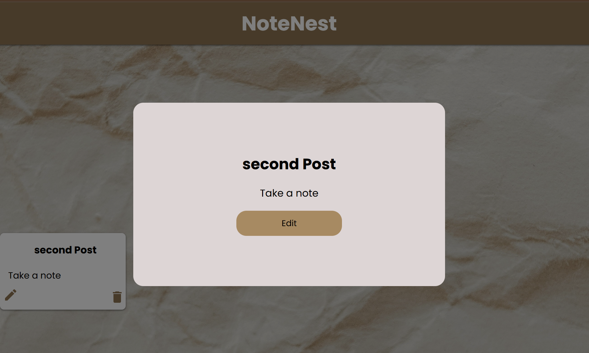
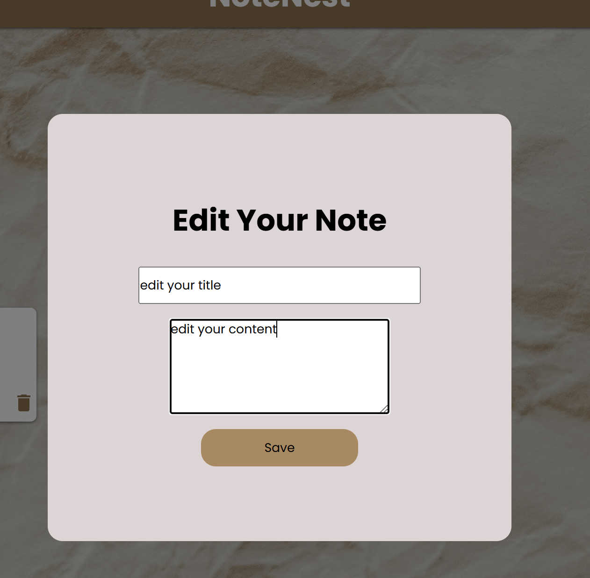

# **NoteNest**

## **Table of Contents**

- [Description](#description)
- [Features](#features)
- [Technologies Used](#technologies-used)
- [Screenshots](#screenshots)
- [Demo Link](#demo-link)
- [Installation](#installation)
- [Author](#author)

## **Description**

**NoteNest** is a sleek and efficient note-taking app designed to simplify organizing your thoughts and tasks. Built using **React**, **Redux**, and **PostgreSQL**, it provides a seamless user experience with essential features to manage your notes effortlessly.

## **Features**

- **Add Notes**: Easily create notes with a title and content.  
- **Edit Notes**: Update your notes as needed to keep them accurate and relevant.  
- **Delete Notes**: Remove unwanted notes to keep your workspace clutter-free.  
- **Persistent Storage**: Notes are securely stored using a PostgreSQL database, ensuring data integrity.  
- **Real-Time State Management**: Powered by Redux for smooth updates and UI consistency.

## **Technologies Used**

- **Frontend**: React (for building dynamic user interfaces)  
- **State Management**: Redux (for managing application state)  
- **Backend**: Node.js and Express.js (for server-side logic and APIs)  
- **Database**: PostgreSQL (for reliable data storage)  
- **Styling**: CSS (for responsive and clean design)  

## **Screenshots**

### Home Page:

### Edit Note:

## **Demo Link**

Try NoteNest live: [NoteNest Demo](https://your-demo-link.com)

